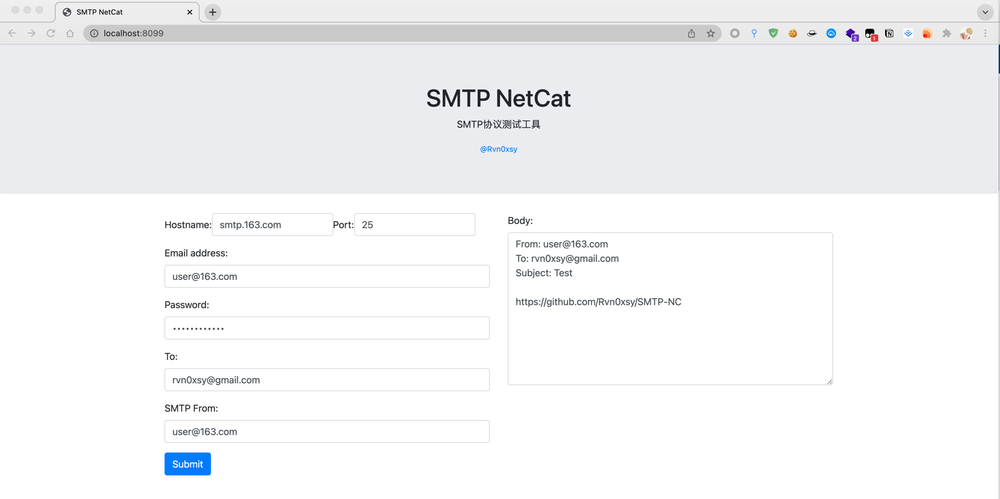

# SMTP-NC

SMTP-NC是一个B/S架构的SMTP协议测试工具。



## 安装方法

### 安装方式 - Golang install

```bash
$ go install -v github.com/Rvn0xsy/SMTP-NC@latest
```

### 安装方式 - 下载二进制文件

[Releases](https://github.com/Rvn0xsy/SMTP-NC/releases)

### 安装方式 - 编译

```bash
$ git clone https://github.com/Rvn0xsy/SMTP-NC
$ cd SMTP-NC
$ make
```

## 快速开始

```bash
$ smtp-nc -listen localhost:8090
```


